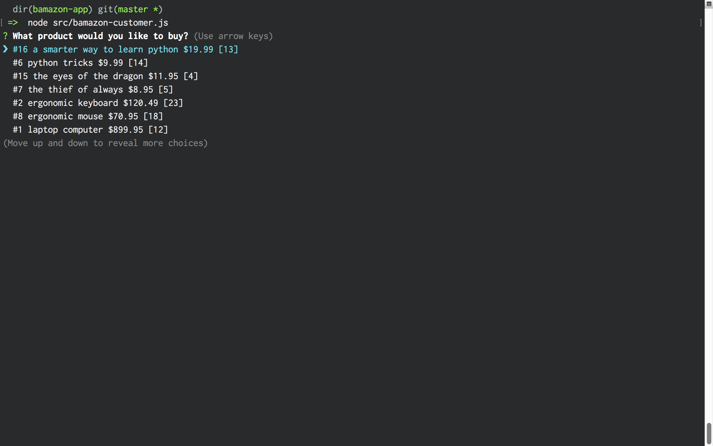

# Bamazon

Bamazon is a command-line application that allows customers to interact with an interface for an Amazon-like store front.

## Use

1.To run the application as a customer

```bash
node src/bamazon-customer.js
```

2.To run the application as a manager

```bash
node src/bamazon-manager.js
```

### CSV File for Import

[Product Table CSV](./assets/csv/product_view.csv)

### Screen Shots

#### Customer




#### Manager

##### Add Inventory


##### Add Product


##### View Items


##### View Low Stocked Items


